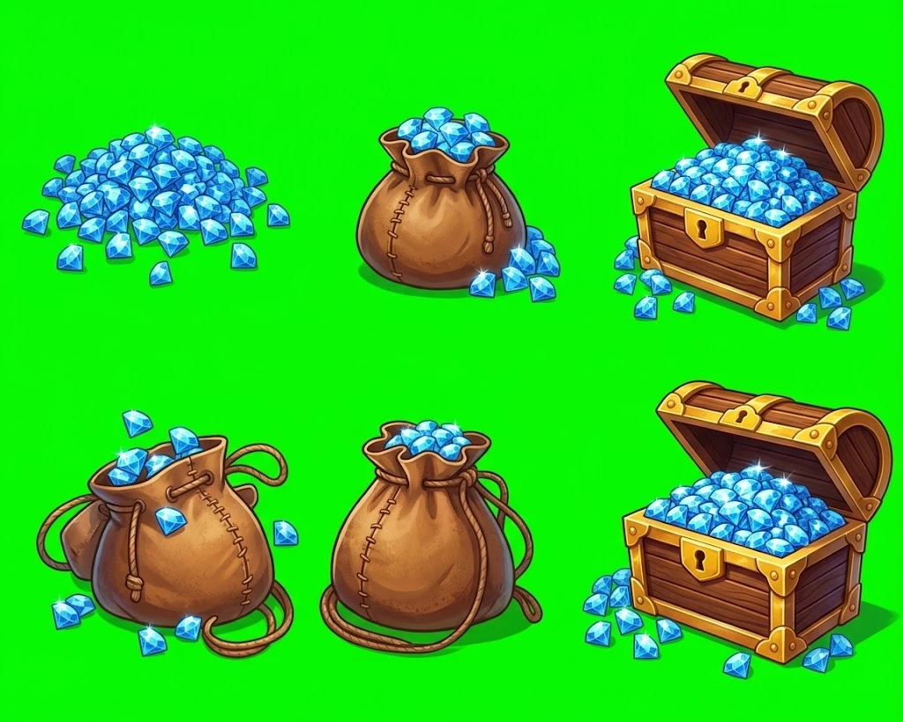

# Monétisation — Mini Adventure

> **Version 1.1.1** · 01/10/2026 · Statut : choix produit à valider, puis prêt à implémenter
> Développe les trois pistes retenues : **des diamants à acheter**, **des objets vraiment extraordinaires**, **agrandir son chez-moi**.
> Le code de référence (§9) a été exécuté et testé avant d'être écrit ici : 20 tests, TypeScript strict. Les chiffres d'économie (§3.4) viennent d'une simulation.

---

## 0. Pour Claude Code : à lire en premier

**Contexte.** Mini Adventure est un jeu mobile pour les 3–10 ans. La monétisation doit respecter les règles Apple et Google pour les apps enfants et le droit européen de la consommation (§2). Ce document fixe les décisions produit, l'économie, les écrans et les modèles de données.

**Décisions déjà prises**

1. **Une seule monnaie : les diamants 💎.** L'enfant les gagne en jouant. Le parent peut en offrir.
2. **Les achats en argent réel se font uniquement dans l'espace parent**, derrière `ParentGate` (déjà présent dans le projet). L'enfant ne voit jamais de bouton d'achat en euros, ni de message l'invitant à acheter ou à demander à ses parents.
3. **3 packs de diamants, pas plus** (§4), plus une **collection légendaire par saison** que le parent peut débloquer en entier (§6.3).
4. **Les diamants servent à deux choses** : acheter des objets (§6) et agrandir la maison (§7). Jamais à acheter des cœurs, des coups ou des niveaux.
5. **Rien n'est aléatoire, rien n'est à durée limitée.** Le contenu de chaque achat est affiché en entier avant l'achat.
6. **Pas de publicité, pas de SDK tiers d'analytics.**

**Avant d'écrire du code**

- Repère : `ParentGate` et l'espace parent, la sauvegarde, la fin de niveau (étoiles), l'écran de la maison s'il existe déjà, et la stack (React Native, Flutter, Unity, natif…) pour choisir la bibliothèque d'achats (§5.7).
- Si le système de cœurs (`systeme-de-vies.md`) est déjà en place, garde-le séparé : aucun lien entre diamants et cœurs.
- Toutes les valeurs d'économie vont dans **un seul fichier de configuration** (§8).

**Livraison en 5 lots** (§11). À chaque lot livré, **incrémente le numéro de version de l'app** selon la convention du projet.

---

## 1. Le modèle en un schéma

```
  ENFANT                                        PARENT (espace parent, ParentGate)
  ──────                                        ──────────────────────────────────
  joue ──► gagne des 💎 ──► achète des objets    offre un pack de 💎 (3 tailles)
                │           agrandit sa maison   ou débloque la collection de saison
                │                 │                          │
                └──── envie de rejouer ◄──────────────┘      │
                                                             ▼
                          « Un cadeau est arrivé ! +450 💎 »  (côté enfant, facultatif)
```

**Le principe de la capture validée :** l'achat **accélère**, il ne **remplace** jamais le jeu. Concrètement, chaque extension de maison demande à la fois des diamants **et** un niveau atteint (§7). Un parent peut offrir des diamants, mais pas faire sauter la progression.

---

## 2. Cadre : règles des stores et droit applicable

> À faire valider par un juriste avant la publication. Ce tableau résume les règles connues au 28/09/2026. Il ne constitue pas un avis juridique.

| Règle | Source | Conséquence dans Mini Adventure |
|---|---|---|
| Achats, liens sortants et demandes de permission uniquement derrière une barrière parentale | Apple, App Review Guidelines §1.3 (catégorie Enfants) | Boutique en euros uniquement dans l'espace parent. Demande d'autorisation des notifications aussi. |
| Pas de pub tierce ; analytics tiers seulement s'ils ne collectent ni IDFA ni donnée identifiante | Apple §1.3 et §5.1.4 | Aucune pub, aucun SDK tiers de mesure |
| Monétisation adaptée à l'âge, conformité COPPA et RGPD | Google Play, règles Familles (exigences « Ads and Monetization ») | Déclarer l'audience cible dans la Play Console, appliquer les mêmes règles qu'iOS |
| Interdiction d'inciter directement un enfant à acheter, **ou à persuader un adulte d'acheter pour lui** | Directive 2005/29/CE, annexe I, point 28 : pratique interdite en toutes circonstances. Appliquée aux jeux vidéo par les autorités européennes. | Aucun appel à l'achat côté enfant, y compris « Demande à tes parents » |
| Prix aussi affiché en monnaie réelle ; pas de coût masqué ; ne pas forcer l'achat de monnaie en trop ; tenir compte de la vulnérabilité des enfants ; pas de techniques de pression | Principes clés du réseau européen CPC sur les monnaies virtuelles (21 mars 2025) | Équivalent en € à côté des 💎 ; tailles de packs alignées sur les prix (§4.2) ; pas d'offres à durée limitée |
| Coffres au contenu aléatoire payés en argent réel = jeux de hasard | Commission belge des jeux de hasard (2018) | Aucun contenu aléatoire contre de l'argent ou des diamants, dans aucun pays |
| Consentement parental pour les données des moins de 15 ans | France : loi Informatique et Libertés (art. 45) et RGPD (art. 8) | Pas de compte, pas de donnée personnelle ; les achats passent par le store |
| Données des moins de 13 ans | COPPA (États-Unis), en cas de sortie aux US | Même approche : aucune collecte |

**À surveiller** : le projet européen de « Digital Fairness Act » vise lui aussi les monnaies virtuelles et le design addictif.

### 2.1 Liste noire : ce que Mini Adventure s'interdit

1. Vendre des cœurs, des coups supplémentaires, des boosters ou le passage d'un niveau.
2. Tout contenu aléatoire contre de l'argent ou des diamants : coffres, roues, pochettes surprises. Même gratuit, on l'évite : le cadeau du jour a un contenu fixe et affiché.
3. Offres à durée limitée, compte à rebours sur un prix, « dernière chance », prix barrés, badges « MEILLEURE OFFRE » qui clignotent.
4. Toute proposition d'achat côté enfant, y compris « Demande à tes parents » ou « Montre ça à papa ou maman ».
5. Notifications de relance commerciale.
6. Séries de connexions qui se cassent (« streaks ») et bonus croissants liés à l'assiduité.
7. Minuteurs de construction ou d'attente qu'on accélère avec des diamants.
8. Publicité, y compris les vidéos récompensées.
9. Une deuxième monnaie premium.
10. Classements, fonctions sociales, échanges entre joueurs.
11. Tailles de packs qui empêchent d'acheter un objet sans reste inutilisable (§4.2).
12. SDK tiers d'analytics ou de publicité.

---

## 3. La monnaie : les diamants

### 3.1 Règles

- **Une seule monnaie.** Les diamants gagnés et achetés sont identiques (fongibles).
- **Le solde n'est jamais négatif.** Une dépense sans solde suffisant est refusée.
- **Pas d'expiration.**
- **Chaque mouvement est inscrit dans un journal** (`LedgerEntry`) avec un identifiant unique. Rejouer un même événement (achat redélivré par le store, niveau revalidé) ne crédite jamais deux fois.
- **Le solde est toujours égal à la somme du journal.** Cette cohérence est vérifiée au chargement (`isConsistent`).
- Le journal alimente aussi l'historique affiché au parent.

### 3.2 Gains

| Source | Gain | Identifiant dans le journal | Remarque |
|---|---|---|---|
| Bienvenue (premier lancement) | 100 💎 | `welcome` | De quoi acheter un ou deux objets ordinaires tout de suite |
| Niveau réussi pour la première fois | 8 💎 | `level:{id}:first` | |
| Chaque étoile obtenue (1 à 3) | 1 💎 | `level:{id}:star:{n}` | Versé aussi quand une étoile est gagnée en rejouant |
| Niveau déjà réussi, rejoué et réussi | 1 💎, **maximum 10 par jour** | `replay:{jour}:{n}` | Garde une source de gains quand il n'y a plus de nouveaux niveaux |
| Cadeau du jour | 10 💎 | `daily:{jour}` | Contenu fixe et affiché. **Pas de série** : rater un jour ne fait rien perdre d'autre que ce cadeau-là. |
| Défis de la semaine | 3 × 20 💎 | `weekly:{semaine}:{n}` | Exemples : « Réussis 5 niveaux », « Gagne 10 étoiles », « Nourris les poissons de l'aquarium » |
| Succès | 25 à 100 💎 | `achv:{id}` | Premier monde terminé (50), première pièce construite (25), 10 niveaux à 3 étoiles (30)… |
| Chemin de saison, palier déjà possédé | 50 💎 | `season:{id}:{palier}` | Voir §6.3 |

`{jour}` est la date **locale** de l'appareil (`2026-09-28`) et `{semaine}` la semaine ISO locale (`2026-W40`).

### 3.3 Dépenses

| Dépense | Prix |
|---|---|
| Objets ordinaires (décor fixe) | 30, 50 ou 80 💎 |
| Objets extraordinaires (vivants, qui changent, qui jouent) | 150 ou 300 💎 |
| Extensions de maison | 300 à 1 500 💎 |
| Objets légendaires | Pas en diamants : chemin de saison, ou achat de la collection par le parent |

### 3.4 Simulation : combien de temps sans rien acheter ?

**Hypothèses** : l'enfant joue 5 jours sur 7, environ 20 minutes, et réussit 5 nouveaux niveaux par jour de jeu avec 2 étoiles en moyenne. Il prend le cadeau du jour et fait les 3 défis de la semaine. Il consacre les deux tiers de ses diamants à la maison et un tiers aux objets.

- **Gains : 360 💎 par semaine**, soit environ 51 par jour calendaire.
- Soit 240 💎 par semaine pour la maison et 120 pour les objets (à peu près un objet extraordinaire par semaine, ou plusieurs ordinaires).

| Étape | Jour d'obtention, sans achat | Avec un « Sac » à 2,49 € par mois |
|---|---|---|
| Jardin agrandi (1re extension) | ≈ jour 6 | ≈ jour 5 |
| Cuisine | ≈ jour 19 | ≈ jour 14 |
| Salle de jeux | ≈ jour 37 (5 semaines) | ≈ jour 26 |
| Étage | ≈ jour 110 (3,5 mois) | ≈ jour 77 |
| Maison principale complète (9 extensions) | ≈ jour 209 (7 mois) | ≈ jour 146 (5 mois) |
| Avec les 3 pièces à thème | ≈ jour 326 (11 mois) | ≈ jour 227 (7,5 mois) |

**Lecture.** Les premières pièces arrivent vite (3 pièces en 5 semaines), puis le rythme ralentit : la maison devient un objectif à long terme. Un parent qui offre 2,49 € par mois fait gagner environ 30 % de temps, sans court-circuiter le jeu : les verrous de niveau restent. Dans ce scénario, les diamants achetés vont entièrement à la maison.

**Point de vigilance.** La simulation suppose qu'il y a assez de niveaux : au rythme de 25 par semaine, le niveau 80 est atteint en un peu plus de 3 semaines. Quand l'enfant a fini tous les niveaux, ses gains tombent à environ 30 💎 par jour de jeu (rejeux plafonnés, cadeau du jour, défis). Il faudra alors ajouter des niveaux, ou relever le plafond des rejeux. **Tous ces chiffres sont à ajuster après des tests avec de vrais enfants.**

---

## 4. Les packs de diamants : 3, pas plus

### 4.1 Les packs

| Pack | Prix (France, TTC) | Diamants | 💎 par euro | Par rapport au petit pack | Correspond à | Jours de jeu équivalents |
|---|---|---|---|---|---|---|
| **Poignée** | 0,99 € | 150 | ≈ 152 | — | un objet extraordinaire | ≈ 3 jours |
| **Sac** | 2,49 € | 450 | ≈ 181 | +19 % | une nouvelle pièce (cuisine) | ≈ 9 jours |
| **Trésor** | 4,99 € | 1 000 | ≈ 200 | +32 % | un étage | ≈ 19 jours |



*Visuels des packs, sur fond vert à détourer. Ligne du haut : **Poignée** (tas de diamants), **Sac**, **Trésor** (coffre ouvert). Ligne du bas : variantes du sac et du coffre.*

Le coffre du Trésor reste toujours **ouvert**, son contenu bien visible. Pas d'animation où l'on ouvre un coffre fermé : elle évoquerait un coffre au contenu aléatoire (§2.1, point 2).

Les prix sont deux fois plus bas qu'en version 1.0.0 (1,99 / 4,99 / 9,99 €), avec les mêmes quantités de diamants : ce sont des montants de petit cadeau, plus faciles à accepter pour un parent. Les tailles de packs ne changent pas, donc l'alignement sur les prix des objets (§4.2) et la simulation (§3.4) restent valables. Si le palier 2,49 € n'est pas proposé pour l'euro dans App Store Connect, prendre le palier disponible le plus proche en dessous.

Identifiants produit proposés : `<bundle>.diamonds.150`, `<bundle>.diamonds.450`, `<bundle>.diamonds.1000` (produits **consommables**). Chez Apple, un identifiant produit supprimé ne peut jamais être réutilisé : il faut bien les choisir dès le départ.

### 4.2 Pourquoi ces tailles

Les principes européens demandent de ne pas forcer l'achat de monnaie en trop, par exemple des packs de 50 pour des objets à 70. Ici :

- les objets extraordinaires coûtent **150 ou 300** et les extensions **300, 450, 600, 900, 1 000 ou 1 500** : tous ces prix s'atteignent **exactement** avec des combinaisons de packs (300 = 2 Poignées, 600 = Sac + Poignée, 900 = 2 Sacs, 1 000 = Trésor, 1 500 = 10 Poignées) ;
- les objets ordinaires (30, 50, 80) absorbent les petits restes ;
- l'enfant a presque toujours des diamants gagnés en plus.

**Règle pour les futurs prix** : un objet extraordinaire ou une extension coûte un multiple de 150, ou exactement 1 000.

### 4.3 Affichage des prix

- **Dans l'espace parent**, le prix affiché est **toujours** celui que fournit le store (`displayPrice` avec StoreKit, `formattedPrice` avec Play Billing), jamais une chaîne codée en dur. Il est donc dans la bonne devise, TVA comprise.
- **Chaque prix en diamants s'accompagne de son équivalent en monnaie réelle** (« ≈ 0,99 € »). Il est calculé sur le pack le plus cher au diamant (la Poignée), pour ne jamais sous-estimer le coût : `realMoneyEquivalentMicros` (§9).
- **Côté enfant**, cet équivalent s'affiche en petit, en gris, sous le prix en diamants. C'est réglable (`showRealMoneyToChild`, activé par défaut), à confirmer avec le juriste.
- Si les prix du store ne sont pas disponibles (hors ligne, premier lancement), on utilise la dernière liste reçue, mise en cache. Si aucune n'a jamais été reçue, on n'affiche **pas** d'équivalent plutôt qu'un faux prix.

### 4.4 Ce que tu touches

**Commission des stores sous 1 M$ de revenus par an :**

- **Apple : 15 %** avec l'App Store Small Business Program. Il faut **s'inscrire**, ce n'est pas automatique ; sans inscription, c'est 30 %.
- **Google** : depuis le **30 juin 2026** (Espace économique européen, États-Unis, Royaume-Uni), la commission est de **10 %** sur le premier million de dollars annuel, plus **5 % de frais de facturation** si l'on utilise Google Play Billing. Au total, **15 %**, comme avant. Ailleurs dans le monde, le nouveau barème arrive progressivement jusqu'en 2027. Il faut aussi rattacher son compte à un « groupe de comptes » dans la Play Console.
- **TVA** : les prix des stores sont TTC. Apple et Google reversent la TVA du pays de l'acheteur (20 % en France, 21 % en Belgique).

| Produit | Prix TTC | Prix HT (TVA 20 %) | Net pour toi (85 % du HT) |
|---|---|---|---|
| Poignée 150 💎 | 0,99 € | 0,83 € | **0,70 €** |
| Sac 450 💎 | 2,49 € | 2,08 € | **1,76 €** |
| Trésor 1 000 💎 | 4,99 € | 4,16 € | **3,53 €** |
| Collection de saison | 3,99 € | 3,33 € | **2,83 €** |

*Montants calculés sur les valeurs exactes, puis arrondis au centime.*

**Ordre de grandeur des revenus** : revenu net mensuel ≈ familles actives × part de familles qui achètent × dépense moyenne TTC ÷ 1,2 × 0,85.
Exemple **purement illustratif**, pas un chiffre de marché : 5 000 familles actives, 2 % qui achètent, 3 € en moyenne → 300 € TTC → **≈ 210 € nets par mois**. Avec des prix plus bas, chaque achat rapporte deux fois moins : il faut deux fois plus d'acheteurs, ou d'achats, pour le même revenu. Un modèle sans pression rapporte peu par joueur : il ne devient rentable qu'avec une large audience (voir §12).

---

## 5. Le parcours d'achat du parent

### 5.1 Écran « Boutique » de l'espace parent

Accessible uniquement après `ParentGate`. De haut en bas :

1. **Explication** (trois lignes) : « Les diamants se gagnent en jouant. Vous pouvez en offrir pour accélérer : ils servent à agrandir la maison et à acheter des objets. Rien n'est tiré au sort, rien n'est à durée limitée. »
2. **Les 3 packs**, sous forme de cartes identiques et sobres. Chaque carte montre : le nom, le nombre de diamants, le prix du store, « soit environ 180 💎 par euro », et « De quoi offrir : une nouvelle pièce ». Pas de badge clignotant ni de mise en avant agressive.
3. **Collection de la saison** : les 5 objets en aperçu animé, le prix, et **la progression de l'enfant** : « Votre enfant peut aussi la gagner en jouant : 3 objets sur 5 déjà obtenus. » Le parent décide en connaissance de cause.
4. **Catalogue** : la liste de tous les objets et extensions, avec leur prix en diamants et l'équivalent en euros.
5. **Historique** : date, produit, prix, statut (crédité, en attente, remboursé). Cette liste vient du journal.
6. **Réglages des achats** (§5.2).
7. **« Restaurer les achats »** : obligatoire chez Apple pour les produits non consommables (les collections de saison).
8. **Rappel des contrôles du store** : sur iOS, « Demander l'achat » du Partage familial ; sur Google Play, « Exiger l'authentification pour les achats ».

### 5.2 Réglages

| Réglage | Valeurs | Par défaut |
|---|---|---|
| Autoriser les achats | oui / non (non = boutique masquée) | oui |
| Plafond mensuel | aucun / 5 € / 10 € / 20 € | aucun |
| Annoncer les cadeaux à l'enfant | oui / non | oui |

Le plafond se calcule sur l'historique local du mois civil, sans compter les achats remboursés (`canPurchase`, §9). S'il est atteint, le message est neutre : « Plafond mensuel atteint. Il se réinitialise le 1er du mois. »

### 5.3 Déroulé technique d'un achat

```
Parent tape « Sac »
  → écran de confirmation dans l'app : contenu, prix du store, « de quoi offrir : une nouvelle pièce »
  → plafond mensuel respecté ?  sinon : message neutre, fin
  → feuille de paiement du store (Face ID / mot de passe)
  → résultat :
      succès     → vérifier la transaction
                 → credit(wallet, { id: "<store>:<transactionId>", reason: "purchase", ... })
                 → sauvegarder
                 → PUIS clôturer : finish() (Apple) / consumeAsync() (Google)
                 → ajouter à l'historique
      en attente → historique « En attente » (le parent a « Demander l'achat » activé)
                   Le crédit arrivera par l'écouteur de transactions (§5.4).
      annulé     → rien
      erreur     → message neutre, rien n'est débité
```

**L'ordre créditer → sauvegarder → clôturer est essentiel.** Si l'app plante avant la clôture, le store redélivre la transaction au lancement suivant. Grâce à l'identifiant unique, elle n'est jamais créditée deux fois.

### 5.4 Écouteur de transactions (au lancement de l'app)

- **Apple (StoreKit 2)** : écouter `Transaction.updates` pendant toute la vie de l'app, et traiter `Transaction.unfinished` au démarrage.
- **Google (Play Billing)** : `PurchasesUpdatedListener`, plus `queryPurchasesAsync(INAPP)` au démarrage et au retour au premier plan, pour traiter les achats passés de *en attente* à *acheté*.
- **Google, produits non consommables (collections)** : chaque achat doit être **acquitté** (`acknowledgePurchase`) **sous 3 jours**, sinon Google le rembourse automatiquement.

### 5.5 Remboursements

- **Principe** : on retire au plus le solde disponible, **jamais de solde négatif** (`applyRefund`, §9). Si l'enfant a déjà dépensé les diamants, on ne lui reprend ni objet ni pièce. Le remboursement est tout de même inscrit au journal (avec un montant de 0 si besoin), pour qu'un événement rejoué ne reprenne pas plus tard des diamants gagnés entre-temps.
- **Apple** : StoreKit 2 renvoie la transaction avec une `revocationDate` dans `Transaction.updates` → `applyRefund` avec l'identifiant `refund:<transactionId>`.
- **Google** : les remboursements de consommables ne sont visibles que par l'API « Voided Purchases », côté serveur. Sans serveur, on ne les traite pas en V1 : les montants sont faibles. C'est à noter pour la V2.
- **Collection de saison remboursée** : les objets ne sont pas retirés, mais le produit n'apparaît plus comme possédé lors d'une restauration.

### 5.6 Sauvegarde et changement d'appareil

**Les produits consommables ne se restaurent pas.** Si la sauvegarde est perdue (appli réinstallée, nouveau téléphone), les diamants achetés disparaissent, et les parents ne manqueront pas de le signaler. Recommandation pour la V1 :

- **iOS** : copier la sauvegarde (portefeuille, maison, cœurs) dans l'**iCloud Key-Value Store**. La limite est de 1 Mo, c'est largement assez, et aucun compte n'est à créer.
- **Android** : activer **Auto Backup** : Android sauvegarde automatiquement les données de l'appli sur le compte Google de l'appareil et les restaure à la réinstallation. Vérifier que le fichier de sauvegarde n'est pas exclu.
- **Synchronisation iOS ↔ Android** : il faut un serveur et un compte parent. C'est pour la V2.

### 5.7 Bibliothèque d'achats selon la stack

| Stack | Bibliothèque |
|---|---|
| iOS natif | StoreKit 2 |
| Android natif | Google Play Billing Library (dernière version majeure exigée par Google) |
| React Native / Expo | `react-native-iap` ou `expo-iap` |
| Flutter | `in_app_purchase` (paquet officiel) |
| Unity | Unity IAP |

Les services tiers comme RevenueCat simplifient beaucoup, mais ce sont des SDK tiers. Avant de les utiliser, vérifier qu'ils ne transmettent ni identifiant d'appareil ni donnée identifiante (Apple §1.3). Par défaut : bibliothèques natives, validation locale de la transaction (signature vérifiée par StoreKit 2 ; signature Play vérifiée avec la clé publique de l'app). Un serveur de validation pourra venir en V2 : l'enjeu de fraude est faible pour un jeu enfant.

---

## 6. Des objets vraiment extraordinaires

**Principe.** Pour valoir de l'argent réel, un objet doit **faire** quelque chose, pas seulement être rare.

### 6.1 Trois paliers, aucun hasard

| Palier | Prix | Ce qu'il fait |
|---|---|---|
| **Ordinaire** | 30 / 50 / 80 💎 | Décor fixe : tapis, cadre, chaise, fleur en pot. Peut être acheté plusieurs fois. |
| **Extraordinaire** | 150 / 300 💎 | Vivant, change avec le temps, ou fait jouer le héros. Un exemplaire par objet. |
| **Légendaire** | Chemin de saison ou achat parent | Collection de 5 objets par saison (§6.3). |

Pour tous : un aperçu animé est visible **avant** l'achat, un tap déclenche la réaction avec un délai minimal de 1 à 2 s entre deux taps (pour éviter le spam sonore), et l'objet respecte le réglage du volume et « Réduire les animations » de l'appareil.

### 6.2 Catalogue de départ

#### Objets vivants (animés en permanence, réagissent au toucher)

| Objet | Tout seul | Au toucher | Prix | Où |
|---|---|---|---|---|
| Aquarium | Les poissons nagent, des bulles montent | Une pincée de nourriture : les poissons montent manger | 150 | Intérieur, sol ou table |
| Cheminée | Flammes animées, crépitement doux | Gerbe d'étincelles ; le héros vient se réchauffer les mains | 150 | Intérieur, mur |
| Horloge coucou | Le balancier oscille. **Le coucou sort à chaque heure pile (heure réelle).** | Le coucou sort | 150 | Mur |
| Bocal à lucioles | Des lucioles volent, **plus lumineuses le soir** (heure réelle) | Elles s'envolent en spirale, puis reviennent | 150 | Table |
| Chat du héros | Dort, s'étire, change de coussin | Ronronne et se frotte contre le héros | 300 | Sol |
| Fusée | Lumières qui clignotent sur le pas de tir | 3, 2, 1… décollage, traversée du ciel, atterrissage 10 s plus tard | 300 | Jardin |

#### Objets qui changent (avec le calendrier réel ou la progression)

| Objet | Évolution | Au toucher | Prix | Où |
|---|---|---|---|---|
| Sapin | Simple toute l'année. **Du 1er au 24 décembre, une décoration de plus chaque jour** (un calendrier de l'Avent visuel). Cadeaux au pied les 25 et 26. Décoré jusqu'au 6 janvier. | Les guirlandes clignotent | 150 | Intérieur |
| Arbre des saisons | Fleurs au printemps, fruits en été, feuilles rousses en automne, neige en hiver. Hémisphère sud géré. | Quelques pétales, feuilles ou flocons tombent | 150 | Jardin |
| Plante magique | **Grandit d'un stade tous les 5 niveaux réussis** : graine, pousse, bouton, fleur, fleur géante | Elle danse | 150 | Intérieur ou jardin |
| Carte au trésor | Se complète à chaque monde terminé | Le héros montre le prochain monde | 150 | Mur |
| Citrouille | Grossit toute l'année ; **en octobre, devient une lanterne sculptée** | Elle s'illumine | 150 | Jardin |
| Bonhomme de neige | Apparaît en hiver. Au printemps, il fond et laisse son écharpe et son chapeau. | Il agite son balai | 150 | Jardin |

#### Objets qui jouent (le héros interagit)

| Objet | Au toucher | Prix | Où |
|---|---|---|---|
| Toboggan | Le héros grimpe et glisse | 300 | Jardin ou salle de jeux |
| Trampoline | Il rebondit ; 3 taps rapides font un salto | 300 | Jardin |
| Balançoire | Il se balance, un peu plus haut à chaque tap | 150 | Jardin |
| Xylophone | Chaque lame joue une note, le héros danse | 300 | Salle de jeux |
| Piscine à balles | Le héros plonge, les balles volent | 300 | Salle de jeux |
| Tente-cabane | Le héros s'y cache ; un tap sur la tente et il surgit (cache-cache) | 150 | Intérieur |

**Idée pour la V2 : des objets qui se répondent.** Un trampoline à côté de la piscine : le héros rebondit et plonge. La cheminée allumée : le chat vient dormir devant.

### 6.3 La collection légendaire de saison

**Fonctionnement**

- **4 collections par an**, une par saison météorologique : printemps (mars à mai), été (juin à août), automne (septembre à novembre), hiver (décembre à février). **5 objets par collection.**
- **Obtenue en jouant**, par le **chemin de saison** : un objet à chacun des paliers de **10, 25, 45, 70 et 100 niveaux réussis pendant la saison** (rejeux compris). Un enfant qui joue régulièrement la termine en 4 à 10 semaines, avant la fin de la saison.
- **Ou débloquée en entier par le parent**, dans l'espace parent : **3,99 €**, produit **non consommable**, restaurable. Les 5 objets arrivent tout de suite. Les paliers du chemin donnent alors **50 💎** à la place de chaque objet déjà possédé.
- **Tout est visible dès le début** : les 5 objets, leur animation, les paliers. **Jamais de tirage au sort.**
- **Pas de peur de rater** : pas de compte à rebours côté enfant. **Chaque collection revient l'année suivante à la même saison**, et la progression est conservée : un enfant qui a eu 3 objets sur 5 termine l'année d'après. Le parent peut acheter une collection passée à tout moment, dans le catalogue.

**Les 4 collections de la première année**

| Saison | Thème | Les 5 objets |
|---|---|---|
| Printemps | **Jardin enchanté** | Arbre à papillons (ils s'envolent en nuée au toucher) · Fontaine arc-en-ciel (un arc-en-ciel apparaît au toucher) · Maison-champignon des lutins (un lutin sort saluer) · Balançoire fleurie · Escargot géant (le héros monte dessus, il avance tout doucement) |
| Été | **Île aux pirates** | Lit bateau pirate (une vague le berce) · Perroquet (il répète le dernier son d'objet touché dans la pièce, **sans micro**) · Palmier-hamac · Canon à confettis · Longue-vue (un navire passe au loin) |
| Automne | **Forêt magique** | Chaudron à bulles (la couleur change au toucher) · Hibou (il cligne des yeux et s'éveille le soir, heure réelle) · Tas de feuilles (le héros saute dedans) · Carrosse-citrouille · Arbre à lanternes (elles s'allument le soir) |
| Hiver | **Pôle Nord** | Igloo-cabane (le héros entre et ressort) · Ourson polaire (dort, bâille, fait un câlin) · Aurores boréales au plafond (couleurs qui changent lentement) · Luge (le héros glisse) · Boule à neige géante (tempête de neige au toucher) |

Identifiants produit proposés : `<bundle>.collection.spring`, `.summer`, `.autumn`, `.winter`, **un par collection**, réutilisé chaque année.

### 6.4 Boutique de la maison, côté enfant

- **Accès** : depuis la maison, bouton « Boutique » avec une icône de brouette ou de sac. **Aucun paiement en euros ici** : seulement des diamants.
- **Onglets** : Intérieur · Jardin · Collection de la saison. Ce dernier onglet montre le chemin de saison et la progression : rien à y acheter.
- **Chaque carte** montre l'objet animé en boucle, le prix en 💎, et l'équivalent en euros en petit (§4.3). Trois états possibles :
  - **Achetable** : la carte brille doucement ;
  - **Pas assez de diamants** : une barre de progression (« Encore 40 💎 : continue à jouer ! ») ;
  - **Verrouillé** : un cadenas et la raison (« Il faut la véranda », « Niveau 20 »).
- **Achat** : une confirmation avec de gros boutons ✅ / ❌ (« Acheter l'aquarium pour 150 💎 ? »), puis le mode placement.
- **Mon objectif** : l'enfant peut épingler **un** objet ou une extension ; une barre de progression s'affiche dans la maison. Cela motive à jouer, pas à acheter. **En V1, l'objectif n'est pas montré au parent** : une liste de souhaits conçue pour être vue par les parents serait une incitation indirecte (§2, point 28).
- **Pour les 3–5 ans** : icônes et voix off plutôt que texte ; aucun geste plus compliqué qu'un tap ou un glisser.

### 6.5 Modèle de données des objets

```ts
type Placement = 'floor' | 'wall' | 'table' | 'garden' | 'water';
type Tier = 'ordinary' | 'extraordinary' | 'legendary';

interface ItemDef {
  id: string;
  nameKey: string;                 // clé de traduction
  tier: Tier;
  price?: number;                  // en 💎 ; absent pour les légendaires
  collectionId?: 'spring' | 'summer' | 'autumn' | 'winter';
  maxOwned: number;                // ordinaire : 99 ; extraordinaire et légendaire : 1
  placement: Placement[];
  requiresExtension?: string;      // ex. 'playroom' pour le xylophone
  behaviors: Behavior[];
}

type Behavior =
  | { kind: 'idle'; anim: string; sound?: string }
  | { kind: 'tap'; anim: string; sound?: string; cooldownMs: number }
  | { kind: 'calendar'; stages: CalendarStage[]; seasonal: boolean } // sapin, arbre des saisons
  | { kind: 'clock'; stages: { fromHour: number; toHour: number; variant: string }[] } // lucioles, hibou
  | { kind: 'hourly'; anim: string }                                  // coucou à l'heure pile
  | { kind: 'progress'; metric: 'levelsWon' | 'worldsCompleted'; thresholds: number[]; variants: string[] }
  | { kind: 'heroPlay'; interaction: 'slide' | 'bounce' | 'swing' | 'hide' | 'music' | 'dive' | 'launch' };
```

- Le **variant** affiché se calcule à l'ouverture de la maison et au retour au premier plan : `resolveCalendarVariant`, `resolveProgressVariant` (§9). Priorité : calendrier, puis progression, puis variant par défaut.
- **Calendrier** : date **locale** de l'appareil. Les plages qui passent d'une année à l'autre (du 1er décembre au 6 janvier) sont gérées. `seasonal: true` décale de 6 mois pour l'hémisphère sud (région de l'appareil) ; les fêtes à date fixe (`seasonal: false`) ne sont pas décalées.
- **Sapin, calendrier de l'Avent** : en décembre, le nombre de décorations vaut `min(24, jour du mois)`.

---

## 7. Agrandir son chez-moi

**Principe.** C'est le meilleur usage des diamants : un but à long terme, visible, sans aucune frustration.

### 7.1 Ce que l'enfant voit

- **La maison vue de l'extérieur grandit** : chaque extension ajoute une couche au dessin (`exteriorLayer`). Cette vue apparaît sur l'écran d'accueil ou sur la carte, pour que les progrès se voient.
- **Chaque extension apporte des emplacements** pour des objets, et **un objet offert** pour en profiter tout de suite.
- **Construction immédiate** : une animation de 3 à 5 secondes (échafaudage, coups de marteau, confettis), puis la caméra fait visiter la nouvelle pièce. **Jamais de minuteur de construction** (§2.1, point 7).

### 7.2 Plan de progression

| # | Extension | Type | Niveau requis | Il faut d'abord | Prix | Emplacements | Objet offert |
|---|---|---|---|---|---|---|---|
| 0 | Chambre (maison de départ) | pièce | — | — | 0 | 6 | Lit du héros |
| 1 | Jardin agrandi | jardin | 5 | — | 300 | 8 (jardin) | Banc |
| 2 | Cuisine | pièce | 10 | Chambre | 450 | 6 | Table et chaises |
| 3 | Salle de jeux | pièce | 20 | Cuisine | 600 | 6 | Caisse à jouets |
| 4 | Véranda | pièce | 30 | Cuisine | 900 | 6 | Plantes vertes |
| 5 | Potager | jardin | 35 | Jardin agrandi | 600 | 6 (jardin) | Rang de carottes |
| 6 | Étage (2 pièces) | étage | 45 | Salle de jeux | 1 000 | 12 | Escalier et lit superposé |
| 7 | Piscine | eau | 55 | Jardin agrandi | 1 000 | 4 (eau) + 4 (jardin) | Bouée canard |
| 8 | Grenier | pièce | 60 | Étage | 900 | 6 | Malle aux déguisements |
| 9 | Ponton sur la rivière | eau | 70 | Jardin agrandi | 1 500 | 6 (eau) | Canne à pêche |
| T1 | Cabane dans l'arbre | thème | 50 | Étage | 1 000 | 6 | Longue-vue |
| T2 | Observatoire | thème | 65 | Étage | 1 500 | 6 | **Télescope qui montre la vraie phase de la Lune ce soir** |
| T3 | Aquarium géant | thème | 80 | Étage | 1 500 | 8 (eau) | Premier poisson |

Les pièces à thème (T1 à T3) se construisent dans l'ordre qu'on veut, une fois l'étage construit. Pour les délais, voir la simulation du §3.4.

**Phase de la Lune** : âge de la lune = `((jours depuis la nouvelle lune de référence du 6 janvier 2000 à 18 h 14 UTC) mod 29,530589)`, puis 8 dessins selon cet âge. C'est assez précis pour un jeu.

### 7.3 L'écran « Agrandir »

- Un bouton avec une icône de marteau, dans la maison.
- **La prochaine extension conseillée est mise en avant**, les autres sont listées dessous.
- **Chaque carte** montre un aperçu de la pièce, son prix et son état, dans cet ordre de priorité (`canBuild`, §9) :
  1. **Déjà construite** : coche verte ;
  2. **Niveau insuffisant** : cadenas et « Niveau 20 » ;
  3. **Il manque une pièce** : « Il faut d'abord la cuisine » ;
  4. **Pas assez de diamants** : barre de progression, « Encore 150 💎 : continue à jouer ! » ;
  5. **Constructible** : la carte brille.
- **Construire** : confirmation avec de gros boutons ✅ / ❌, dépense (`spend`, identifiant `ext:{id}`), animation, visite, puis placement de l'objet offert.

### 7.4 Emplacements plutôt que placement libre

Chaque pièce a des emplacements prédéfinis, typés (`floor`, `wall`, `table`, `garden`, `water`). Un objet ne se pose que sur un emplacement compatible. C'est bien plus rapide à développer qu'une grille libre, et impossible à « casser » pour un enfant de 4 ans. Déplacer un objet revient à le glisser d'un emplacement à un autre ; le ranger le remet dans l'inventaire.

### 7.5 Modèle de données de la maison

```ts
interface ExtensionDef {
  id: string;                         // 'kitchen', 'upstairs'…
  nameKey: string;
  kind: 'room' | 'floor' | 'garden' | 'themed';
  requiredLevel: number;
  price: number;
  requires: string[];                 // extensions à construire avant
  slots: { id: string; placement: Placement; x: number; y: number }[];
  exteriorLayer: string;              // calque de la vue extérieure
  starterItemId?: string;             // objet offert
}

interface HomeState {
  schemaVersion: 1;
  ownedExtensions: string[];          // commence par ['bedroom']
  ownedItems: { instanceId: string; itemId: string; acquiredAtMs: number }[];
  placements: Record<string, string>; // slotId → instanceId
}
```

---

## 8. Configuration économique (fichier unique)

```ts
export const ECONOMY = {
  welcomeGift: 100,
  earn: {
    levelFirstClear: 8,
    perStar: 1,                 // versé une seule fois par étoile et par niveau
    levelReplay: 1,
    levelReplayDailyCap: 10,
    dailyGift: 10,
    weeklyChallenge: 20,
    weeklyChallengesCount: 3,
    seasonDuplicateReward: 50,  // palier de saison déjà possédé
    achievements: { firstWorldCompleted: 50, firstRoomBuilt: 25, tenThreeStarLevels: 30 },
  },
  packs: [
    { productId: '<bundle>.diamonds.150', diamonds: 150 },
    { productId: '<bundle>.diamonds.450', diamonds: 450 },
    { productId: '<bundle>.diamonds.1000', diamonds: 1000 },
  ],
  season: {
    thresholds: [10, 25, 45, 70, 100], // niveaux réussis pendant la saison
    productIds: {
      spring: '<bundle>.collection.spring', summer: '<bundle>.collection.summer',
      autumn: '<bundle>.collection.autumn', winter: '<bundle>.collection.winter',
    },
  },
  display: { showRealMoneyToChild: true },
  parentDefaults: { purchasesEnabled: true, monthlyCapMicros: null as number | null, announceGiftToChild: true },
} as const;
```

Les prix des objets et des extensions sont dans leurs définitions (`ItemDef.price`, `ExtensionDef.price`), qui vivent aussi dans des fichiers de données, jamais dans le code des écrans.

---

## 9. Code de référence (TypeScript, testé)

Fonctions pures, sans dépendance, à porter dans la stack du projet avec leurs tests.

### 9.1 Portefeuille : `wallet.ts`

| Fonction | Rôle |
|---|---|
| `credit(wallet, entry)` | Crédit idempotent |
| `spend(wallet, entry)` | Dépense ; refusée si le solde est insuffisant (renvoie ce qui manque) |
| `applyRefund(wallet, entry)` | Remboursement plafonné au solde, journalisé même à 0 |
| `countForDay(wallet, reason, dayKey)` | Pour les plafonds journaliers (rejeux) |
| `isConsistent(wallet)` | Solde = somme du journal, et ≥ 0 |
| `realMoneyEquivalentMicros(diamonds, packs)` | Équivalent en monnaie réelle, jamais sous-estimé |
| `canPurchase(cap, purchases, monthKeyOf, now, price)` | Plafond mensuel du parent |

```ts
// wallet.ts — portefeuille de diamants avec journal (ledger). Fonctions pures.

export type Reason =
  | 'welcome' | 'level_first_clear' | 'level_new_star' | 'level_replay' | 'daily_gift'
  | 'weekly_challenge' | 'achievement' | 'season_reward' | 'purchase' | 'refund'
  | 'spend_item' | 'spend_extension';

export interface LedgerEntry {
  /** Clé d'idempotence : transactionId store, "level:12:first", "daily:2026-09-28"… */
  id: string;
  atMs: number;
  /** Positif = gain, négatif = dépense. 0 uniquement pour un remboursement déjà dépensé. */
  delta: number;
  reason: Reason;
  /** Contexte libre : id d'objet, jour local "2026-09-28", productId… */
  ref?: string;
}

export interface WalletState {
  schemaVersion: 1;
  balance: number;
  entries: LedgerEntry[];
}

export const emptyWallet = (): WalletState => ({ schemaVersion: 1, balance: 0, entries: [] });

export const hasEntry = (w: WalletState, id: string) => w.entries.some((e) => e.id === id);

/** Crédit idempotent : rejouer le même id ne crédite pas deux fois. */
export function credit(w: WalletState, e: Omit<LedgerEntry, 'delta'> & { amount: number }): WalletState {
  if (e.amount <= 0 || !Number.isInteger(e.amount)) throw new Error(`montant invalide: ${e.amount}`);
  if (hasEntry(w, e.id)) return w;
  const { amount, ...rest } = e;
  return { ...w, balance: w.balance + amount, entries: [...w.entries, { ...rest, delta: amount }] };
}

export type SpendResult =
  | { ok: true; wallet: WalletState }
  | { ok: false; wallet: WalletState; reason: 'INSUFFICIENT'; missing: number };

/** Dépense : refusée si solde insuffisant. Jamais de solde négatif. */
export function spend(w: WalletState, e: Omit<LedgerEntry, 'delta'> & { amount: number }): SpendResult {
  if (e.amount <= 0 || !Number.isInteger(e.amount)) throw new Error(`montant invalide: ${e.amount}`);
  if (hasEntry(w, e.id)) return { ok: true, wallet: w };
  if (w.balance < e.amount) return { ok: false, wallet: w, reason: 'INSUFFICIENT', missing: e.amount - w.balance };
  const { amount, ...rest } = e;
  return { ok: true, wallet: { ...w, balance: w.balance - amount, entries: [...w.entries, { ...rest, delta: -amount }] } };
}

/**
 * Remboursement store : retire au plus le solde disponible (jamais négatif).
 * `shortfall` > 0 signifie que les diamants avaient déjà été dépensés : on ne reprend rien à l'enfant.
 */
export function applyRefund(w: WalletState, e: { id: string; atMs: number; amount: number; ref?: string }): { wallet: WalletState; shortfall: number } {
  if (hasEntry(w, e.id)) return { wallet: w, shortfall: 0 };
  const taken = Math.min(w.balance, e.amount);
  const shortfall = e.amount - taken;
  // On journalise même si rien n'est repris (delta 0) : sinon un événement rejoué plus tard
  // reprendrait des diamants gagnés entre-temps.
  return {
    wallet: { ...w, balance: w.balance - taken, entries: [...w.entries, { id: e.id, atMs: e.atMs, delta: -taken, reason: 'refund', ref: e.ref }] },
    shortfall,
  };
}

/** Nombre de crédits d'un motif pour un jour local donné (ex. plafond des rejeux). */
export const countForDay = (w: WalletState, reason: Reason, dayKey: string) =>
  w.entries.filter((e) => e.reason === reason && e.ref === dayKey).length;

/** Le solde doit toujours égaler la somme du journal. À vérifier au chargement. */
export const isConsistent = (w: WalletState) => w.balance === w.entries.reduce((s, e) => s + e.delta, 0) && w.balance >= 0;

// ——— Prix en vraie monnaie ———

export interface StorePack { productId: string; diamonds: number; priceMicros: number; currency: string }

/**
 * Équivalent monétaire d'un prix en diamants, calculé sur le pack le plus cher au diamant
 * (le plus petit) : l'estimation n'est jamais inférieure au coût réel.
 */
export function realMoneyEquivalentMicros(diamonds: number, packs: StorePack[]): { micros: number; currency: string } | null {
  if (packs.length === 0) return null;
  const ref = packs.reduce((a, b) => (a.priceMicros / a.diamonds >= b.priceMicros / b.diamonds ? a : b));
  return { micros: Math.ceil((diamonds * ref.priceMicros) / ref.diamonds / 10_000) * 10_000, currency: ref.currency };
}

// ——— Plafond mensuel parent ———

export interface PurchaseRecord { transactionId: string; productId: string; priceMicros: number; currency: string; atMs: number; refunded: boolean }

/** Total dépensé sur le mois civil local de `now` (hors remboursés). `monthKey` fourni par l'appelant (fuseau local). */
export function spentThisMonthMicros(purchases: PurchaseRecord[], monthKeyOf: (ms: number) => string, now: number): number {
  const key = monthKeyOf(now);
  return purchases.filter((p) => !p.refunded && monthKeyOf(p.atMs) === key).reduce((s, p) => s + p.priceMicros, 0);
}

export function canPurchase(capMicros: number | null, purchases: PurchaseRecord[], monthKeyOf: (ms: number) => string, now: number, priceMicros: number): boolean {
  if (capMicros === null) return true;
  return spentThisMonthMicros(purchases, monthKeyOf, now) + priceMicros <= capMicros;
}
```

### 9.2 Maison et objets : `home.ts`

| Fonction | Rôle |
|---|---|
| `canBuild(home, ext, highestLevelWon, balance)` | Peut-on construire ? Sinon, pourquoi (dans l'ordre d'affichage) |
| `inRange(date, from, to)` | Plage de dates, y compris à cheval sur deux années |
| `resolveCalendarVariant(stages, now, fallback, opts)` | Variant du jour (sapin, saisons, hémisphère sud) |
| `resolveProgressVariant(value, thresholds, variants)` | Variant selon la progression (plante magique) |

```ts
// home.ts — maison, extensions et objets qui changent. Fonctions pures.

export type ExtensionId = string;
export type Placement = 'floor' | 'wall' | 'table' | 'garden' | 'water';

export interface SlotDef { id: string; placement: Placement; x: number; y: number }

export interface ExtensionDef {
  id: ExtensionId;
  nameKey: string;
  kind: 'room' | 'floor' | 'garden' | 'themed';
  requiredLevel: number;
  price: number;
  requires: ExtensionId[];
  slots: SlotDef[];
  exteriorLayer: string;
  starterItemId?: string;
}

export interface HomeState {
  schemaVersion: 1;
  ownedExtensions: ExtensionId[];
  ownedItems: { instanceId: string; itemId: string; acquiredAtMs: number }[];
  /** slotId → instanceId (ou absent si vide) */
  placements: Record<string, string>;
}

export type BuildCheck =
  | { ok: true }
  | { ok: false; reason: 'ALREADY_OWNED' }
  | { ok: false; reason: 'LOCKED_LEVEL'; requiredLevel: number }
  | { ok: false; reason: 'MISSING_PREREQ'; missing: ExtensionId[] }
  | { ok: false; reason: 'INSUFFICIENT'; missing: number };

/** Ordre des contrôles = ordre d'affichage : cadenas de niveau avant le manque de diamants. */
export function canBuild(home: HomeState, ext: ExtensionDef, highestLevelWon: number, balance: number): BuildCheck {
  if (home.ownedExtensions.includes(ext.id)) return { ok: false, reason: 'ALREADY_OWNED' };
  if (highestLevelWon < ext.requiredLevel) return { ok: false, reason: 'LOCKED_LEVEL', requiredLevel: ext.requiredLevel };
  const missing = ext.requires.filter((r) => !home.ownedExtensions.includes(r));
  if (missing.length) return { ok: false, reason: 'MISSING_PREREQ', missing };
  if (balance < ext.price) return { ok: false, reason: 'INSUFFICIENT', missing: ext.price - balance };
  return { ok: true };
}

// ——— Objets qui changent selon le calendrier ———

/** Mois 1–12, jour 1–31, en heure LOCALE de l'appareil. */
export interface MonthDay { m: number; d: number }
export interface CalendarStage { from: MonthDay; to: MonthDay; variant: string }

const key = (md: MonthDay) => md.m * 100 + md.d;

/** Vrai si `date` est dans [from, to] inclus. Gère le passage d'année (1er déc → 6 janv). */
export function inRange(date: MonthDay, from: MonthDay, to: MonthDay): boolean {
  const k = key(date), a = key(from), b = key(to);
  return a <= b ? k >= a && k <= b : k >= a || k <= b;
}

/** Hémisphère sud : on décale de 6 mois les étapes saisonnières (pas les fêtes à date fixe). */
export function shiftSouth(md: MonthDay): MonthDay {
  return { m: ((md.m + 5) % 12) + 1, d: md.d };
}

export function resolveCalendarVariant(stages: CalendarStage[], now: Date, fallback: string, opts: { southern?: boolean; seasonal?: boolean } = {}): string {
  const today: MonthDay = { m: now.getMonth() + 1, d: now.getDate() };
  for (const s of stages) {
    const shift = opts.southern && opts.seasonal;
    const from = shift ? shiftSouth(s.from) : s.from;
    const to = shift ? shiftSouth(s.to) : s.to;
    if (inRange(today, from, to)) return s.variant;
  }
  return fallback;
}

/** Objets qui évoluent avec la progression (plante qui grandit tous les N niveaux…). */
export function resolveProgressVariant(value: number, thresholds: number[], variants: string[]): string {
  let i = 0;
  while (i < thresholds.length && value >= thresholds[i]) i++;
  return variants[Math.min(i, variants.length - 1)];
}
```

<details>
<summary>Tests complets (<code>wallet.test.ts</code>, <code>home.test.ts</code>) : 20 tests réussis</summary>

```ts
import { describe, expect, test } from 'bun:test';
import { emptyWallet, credit, spend, applyRefund, countForDay, isConsistent, realMoneyEquivalentMicros, canPurchase, type StorePack, type PurchaseRecord } from './wallet';

const T = Date.UTC(2026, 8, 28, 12);
const PACKS: StorePack[] = [
  { productId: 'diamonds_150', diamonds: 150, priceMicros: 990_000, currency: 'EUR' },
  { productId: 'diamonds_450', diamonds: 450, priceMicros: 2_490_000, currency: 'EUR' },
  { productId: 'diamonds_1000', diamonds: 1000, priceMicros: 4_990_000, currency: 'EUR' },
];

describe('portefeuille', () => {
  test('crédit idempotent', () => {
    let w = credit(emptyWallet(), { id: 'level:12:first', atMs: T, amount: 10, reason: 'level_first_clear' });
    w = credit(w, { id: 'level:12:first', atMs: T, amount: 10, reason: 'level_first_clear' });
    expect(w.balance).toBe(10);
    expect(w.entries).toHaveLength(1);
  });
  test('achat store rejoué (même transactionId) : un seul crédit', () => {
    let w = credit(emptyWallet(), { id: 'apple:2000000123', atMs: T, amount: 450, reason: 'purchase', ref: 'diamonds_450' });
    w = credit(w, { id: 'apple:2000000123', atMs: T + 5, amount: 450, reason: 'purchase', ref: 'diamonds_450' });
    expect(w.balance).toBe(450);
  });
  test('dépense refusée si solde insuffisant', () => {
    const w = credit(emptyWallet(), { id: 'welcome', atMs: T, amount: 100, reason: 'welcome' });
    const r = spend(w, { id: 'buy:aquarium:1', atMs: T, amount: 150, reason: 'spend_item', ref: 'aquarium' });
    expect(r.ok).toBe(false);
    if (r.ok) throw 0;
    expect(r.missing).toBe(50);
    expect(r.wallet.balance).toBe(100);
  });
  test('dépense acceptée', () => {
    const w = credit(emptyWallet(), { id: 'p1', atMs: T, amount: 450, reason: 'purchase' });
    const r = spend(w, { id: 'ext:kitchen', atMs: T, amount: 450, reason: 'spend_extension', ref: 'kitchen' });
    expect(r.ok && r.wallet.balance).toBe(0);
    if (r.ok) expect(isConsistent(r.wallet)).toBe(true);
  });
  test('remboursement : jamais de solde négatif', () => {
    let w = credit(emptyWallet(), { id: 'p1', atMs: T, amount: 450, reason: 'purchase' });
    const r = spend(w, { id: 's1', atMs: T, amount: 300, reason: 'spend_extension' });
    if (!r.ok) throw 0;
    const { wallet, shortfall } = applyRefund(r.wallet, { id: 'refund:p1', atMs: T, amount: 450 });
    expect(wallet.balance).toBe(0);
    expect(shortfall).toBe(300);
    expect(isConsistent(wallet)).toBe(true);
  });
  test('remboursement idempotent', () => {
    let w = credit(emptyWallet(), { id: 'p1', atMs: T, amount: 450, reason: 'purchase' });
    w = applyRefund(w, { id: 'refund:p1', atMs: T, amount: 450 }).wallet;
    w = applyRefund(w, { id: 'refund:p1', atMs: T, amount: 450 }).wallet;
    expect(w.balance).toBe(0);
    expect(w.entries).toHaveLength(2);
  });
  test('remboursement à solde nul puis rejoué après de nouveaux gains : ne reprend rien', () => {
    let w = applyRefund(emptyWallet(), { id: 'refund:p1', atMs: T, amount: 450 }).wallet;
    w = credit(w, { id: 'level:50:first', atMs: T + 1, amount: 10, reason: 'level_first_clear' });
    w = applyRefund(w, { id: 'refund:p1', atMs: T + 2, amount: 450 }).wallet;
    expect(w.balance).toBe(10);
    expect(isConsistent(w)).toBe(true);
  });
  test('plafond journalier des rejeux', () => {
    let w = emptyWallet();
    for (let i = 0; i < 12; i++) {
      if (countForDay(w, 'level_replay', '2026-09-28') < 10) w = credit(w, { id: `replay:2026-09-28:${i}`, atMs: T, amount: 1, reason: 'level_replay', ref: '2026-09-28' });
    }
    expect(w.balance).toBe(10);
  });
});

describe('prix en euros', () => {
  test('équivalent calculé sur le pack le plus cher au diamant, arrondi au centime supérieur', () => {
    expect(realMoneyEquivalentMicros(150, PACKS)).toEqual({ micros: 990_000, currency: 'EUR' });
    expect(realMoneyEquivalentMicros(450, PACKS)).toEqual({ micros: 2_970_000, currency: 'EUR' });
    expect(realMoneyEquivalentMicros(80, PACKS)!.micros).toBe(530_000); // 0,528 → 0,53
  });
  test('sans packs chargés : null (on n\'affiche pas de faux prix)', () => {
    expect(realMoneyEquivalentMicros(150, [])).toBeNull();
  });
});

describe('plafond mensuel', () => {
  const monthKeyOf = (ms: number) => new Date(ms).toISOString().slice(0, 7);
  const purchases: PurchaseRecord[] = [
    { transactionId: 'a', productId: 'diamonds_450', priceMicros: 2_490_000, currency: 'EUR', atMs: T, refunded: false },
    { transactionId: 'b', productId: 'diamonds_450', priceMicros: 2_490_000, currency: 'EUR', atMs: T, refunded: true },
    { transactionId: 'c', productId: 'diamonds_1000', priceMicros: 4_990_000, currency: 'EUR', atMs: Date.UTC(2026, 7, 30), refunded: false },
  ];
  test('ne compte que le mois en cours et ignore les remboursés', () => {
    expect(canPurchase(5_000_000, purchases, monthKeyOf, T, 2_490_000)).toBe(true);  // 2,49 + 2,49 = 4,98
    expect(canPurchase(5_000_000, purchases, monthKeyOf, T, 4_990_000)).toBe(false); // 2,49 + 4,99 = 7,48
    expect(canPurchase(null, purchases, monthKeyOf, T, 99_990_000)).toBe(true);
  });
});
```

```ts
import { describe, expect, test } from 'bun:test';
import { canBuild, inRange, resolveCalendarVariant, resolveProgressVariant, type ExtensionDef, type HomeState } from './home';

const home: HomeState = { schemaVersion: 1, ownedExtensions: ['bedroom'], ownedItems: [], placements: {} };
const kitchen: ExtensionDef = { id: 'kitchen', nameKey: 'ext.kitchen', kind: 'room', requiredLevel: 10, price: 450, requires: ['bedroom'], slots: [], exteriorLayer: 'ext_kitchen' };
const upstairs: ExtensionDef = { ...kitchen, id: 'upstairs', requiredLevel: 45, price: 1000, requires: ['kitchen'] };

describe('extensions', () => {
  test('niveau insuffisant : cadenas, même avec assez de diamants', () => {
    expect(canBuild(home, kitchen, 9, 5000)).toEqual({ ok: false, reason: 'LOCKED_LEVEL', requiredLevel: 10 });
  });
  test('prérequis manquant', () => {
    expect(canBuild(home, upstairs, 50, 5000)).toEqual({ ok: false, reason: 'MISSING_PREREQ', missing: ['kitchen'] });
  });
  test('diamants insuffisants', () => {
    expect(canBuild(home, kitchen, 10, 400)).toEqual({ ok: false, reason: 'INSUFFICIENT', missing: 50 });
  });
  test('ok', () => {
    expect(canBuild(home, kitchen, 12, 450)).toEqual({ ok: true });
  });
  test('déjà construite', () => {
    expect(canBuild({ ...home, ownedExtensions: ['bedroom', 'kitchen'] }, kitchen, 99, 9999)).toEqual({ ok: false, reason: 'ALREADY_OWNED' });
  });
});

describe('calendrier', () => {
  const tree = [
    { from: { m: 12, d: 25 }, to: { m: 12, d: 26 }, variant: 'tree_presents' },
    { from: { m: 12, d: 1 }, to: { m: 1, d: 6 }, variant: 'tree_decorated' },
  ];
  test('passage d\'année', () => {
    expect(inRange({ m: 1, d: 3 }, { m: 12, d: 1 }, { m: 1, d: 6 })).toBe(true);
    expect(inRange({ m: 1, d: 7 }, { m: 12, d: 1 }, { m: 1, d: 6 })).toBe(false);
    expect(inRange({ m: 11, d: 30 }, { m: 12, d: 1 }, { m: 1, d: 6 })).toBe(false);
  });
  test('sapin : première étape qui correspond gagne', () => {
    expect(resolveCalendarVariant(tree, new Date(2026, 11, 25), 'tree_plain')).toBe('tree_presents');
    expect(resolveCalendarVariant(tree, new Date(2026, 11, 10), 'tree_plain')).toBe('tree_decorated');
    expect(resolveCalendarVariant(tree, new Date(2027, 0, 5), 'tree_plain')).toBe('tree_decorated');
    expect(resolveCalendarVariant(tree, new Date(2026, 6, 14), 'tree_plain')).toBe('tree_plain');
  });
  test('saisons, hémisphère sud', () => {
    const garden = [
      { from: { m: 3, d: 20 }, to: { m: 6, d: 20 }, variant: 'spring' },
      { from: { m: 6, d: 21 }, to: { m: 9, d: 21 }, variant: 'summer' },
      { from: { m: 9, d: 22 }, to: { m: 12, d: 20 }, variant: 'autumn' },
      { from: { m: 12, d: 21 }, to: { m: 3, d: 19 }, variant: 'winter' },
    ];
    const july = new Date(2026, 6, 14);
    expect(resolveCalendarVariant(garden, july, 'x')).toBe('summer');
    expect(resolveCalendarVariant(garden, july, 'x', { southern: true, seasonal: true })).toBe('winter');
  });
});

describe('progression', () => {
  test('plante qui grandit tous les 5 niveaux', () => {
    const v = ['seed', 'sprout', 'bud', 'flower', 'giant'];
    expect(resolveProgressVariant(0, [5, 10, 15, 20], v)).toBe('seed');
    expect(resolveProgressVariant(5, [5, 10, 15, 20], v)).toBe('sprout');
    expect(resolveProgressVariant(19, [5, 10, 15, 20], v)).toBe('flower');
    expect(resolveProgressVariant(500, [5, 10, 15, 20], v)).toBe('giant');
  });
});
```

</details>

---

## 10. Suivre les résultats sans SDK tiers

- **Revenus, ventes par produit, remboursements** : App Store Connect et Google Play Console. C'est suffisant pour démarrer.
- **Dans l'app** : aucune mesure envoyée à un tiers. Si un besoin apparaît plus tard, mesure maison, agrégée, sans identifiant d'appareil ni d'enfant (Apple §1.3).
- **À regarder chaque mois** : ventes par pack (si la Poignée domine, les parents font des petits cadeaux ponctuels), taux de remboursement (s'il monte, des enfants achètent peut-être sans le parent : renforcer `ParentGate`), achats de collections comparés à la progression gratuite.

---

## 11. Lots de livraison et critères d'acceptation

### Lot A : portefeuille et gains (sans achat réel)

- Porter `wallet.ts` et ses tests. Ajouter le portefeuille à la sauvegarde.
- Brancher tous les gains du §3.2 avec leurs identifiants de journal.
- Compteur de diamants dans l'interface, avec une petite animation au gain.

**Critères**

- [ ] Réussir un niveau neuf avec 2 étoiles donne 10 💎 ; le rejouer et obtenir 3 étoiles donne +1 💎 ; le rejouer encore donne +1 💎, dans la limite de 10 par jour.
- [ ] Le cadeau du jour ne se prend qu'une fois par jour local, et rater un jour n'a aucune autre conséquence.
- [ ] Tuer l'app pendant un gain puis la relancer ne crédite jamais deux fois.
- [ ] `isConsistent` est vrai au chargement ; sinon, le solde est recalculé depuis le journal.
- [ ] Version de l'app incrémentée.

### Lot B : maison, extensions et objets ordinaires

- Écran de la maison avec emplacements (§7.4), vue extérieure en calques, écran « Agrandir » (§7.3).
- Boutique côté enfant (§6.4) avec les objets ordinaires. Objet offert à chaque extension.
- Mettre la maison en lien avec l'écran « sieste » des cœurs, si le système de cœurs existe.

**Critères**

- [ ] Une extension au niveau insuffisant affiche un cadenas, même avec assez de diamants.
- [ ] Construire est immédiat (animation de moins de 5 s), et la vue extérieure change.
- [ ] Aucun prix en euros n'est cliquable côté enfant ; l'équivalent en euros s'affiche en petit sous chaque prix.
- [ ] Version de l'app incrémentée.

### Lot C : objets extraordinaires

- Système de comportements (§6.5) et les 18 objets du catalogue (§6.2).

**Critères**

- [ ] Régler l'appareil sur le 10 décembre donne un sapin avec 10 décorations ; le 25, des cadeaux ; le 7 janvier, un sapin simple.
- [ ] Le coucou sort à l'heure pile réelle pendant que la maison est ouverte.
- [ ] La plante magique change de stade au 5e, 10e, 15e et 20e niveau réussi.
- [ ] Taper 10 fois de suite sur un objet ne déclenche pas 10 sons superposés.
- [ ] Version de l'app incrémentée.

### Lot D : boutique parent et achats réels

- Écran boutique parent (§5.1), réglages (§5.2), achats (§5.3), écouteur de transactions (§5.4), remboursements Apple (§5.5), sauvegarde iCloud KVS / Auto Backup (§5.6).
- Créer les 3 produits consommables dans App Store Connect et la Play Console. S'inscrire au Small Business Program d'Apple et configurer le groupe de comptes Google.

**Critères**

- [ ] Impossible d'atteindre un achat en euros sans passer par `ParentGate`.
- [ ] Les prix affichés sont ceux du store, dans la devise de l'appareil (tester avec un compte bac à sable dans un autre pays).
- [ ] Achat réussi : diamants crédités une seule fois, même si l'app est tuée juste après le paiement.
- [ ] « Demander l'achat » : l'achat reste en attente, puis il est crédité automatiquement après validation, même si l'app était fermée.
- [ ] Le plafond mensuel bloque l'achat qui le dépasserait.
- [ ] Un remboursement Apple sur des diamants déjà dépensés ramène le solde à 0, jamais en dessous.
- [ ] Désinstaller puis réinstaller l'app (même compte iCloud ou Google) restaure diamants et maison. Sur Android, c'est la dernière sauvegarde automatique, qui peut dater de 24 h environ.
- [ ] Version de l'app incrémentée.

### Lot E : collections de saison

- Chemin de saison (paliers, progression conservée d'une année à l'autre), 4 produits non consommables, « Restaurer les achats », collection de la saison dans la boutique parent avec la progression de l'enfant.
- Première collection livrée : celle de la saison en cours au moment de la sortie.

**Critères**

- [ ] Le 10e niveau réussi pendant la saison débloque le 1er objet.
- [ ] Achat par le parent : les 5 objets arrivent tout de suite, et les paliers suivants donnent 50 💎.
- [ ] « Restaurer les achats » sur un autre appareil rend la collection.
- [ ] Google : l'achat est acquitté (sinon il est remboursé au bout de 3 jours).
- [ ] Aucun compte à rebours de fin de saison côté enfant.
- [ ] Version de l'app incrémentée.

---

## 12. Questions ouvertes (pour toi)

1. **Combien de niveaux** le jeu a-t-il aujourd'hui, et à quel rythme en ajoutes-tu ? C'est ce qui décide si l'économie tient (§3.4).
2. **Équivalent en euros côté enfant** : on l'affiche (prudent juridiquement) ou on le réserve à l'espace parent (plus lisible pour un enfant de 4 ans) ? À trancher avec un juriste.
3. **Pays de sortie** : la France seulement, l'Europe, ou aussi les États-Unis (COPPA) ?
4. **Serveur** : en V1, tout est local (sauvegarde iCloud et Android). Un serveur deviendra utile pour les remboursements Google et la synchronisation iOS ↔ Android.
5. **Revenus** : un modèle sans pression rapporte peu par joueur. Si l'audience reste modeste, deux compléments sont possibles sans renier les principes : une **version complète** payante une seule fois, ou un **abonnement famille** donnant accès à toutes les collections. À étudier après les premiers chiffres.

---

## Sources

- Apple, catégorie Enfants et barrière parentale : [App Review Guidelines, §1.3 et §5.1.4](https://developer.apple.com/app-store/review/guidelines/)
- Apple, commission à 15 % : [App Store Small Business Program](https://developer.apple.com/app-store/small-business-program/)
- Google, règles Familles : [Google Play Families Policies](https://support.google.com/googleplay/android-developer/answer/9893335)
- Google, nouveau barème au 30 juin 2026 : [Android Developers Blog, « Expanded billing choice and lower fees on Google Play »](https://android-developers.googleblog.com/2026/06/play-expanded-billing.html) · [Play Console Help, « Understanding Google Play's lower service fees »](https://support.google.com/googleplay/android-developer/answer/16954621)
- Incitation directe des enfants : [Directive 2005/29/CE, annexe I, point 28](https://eur-lex.europa.eu/LexUriServ/LexUriServ.do?uri=OJ%3AL%3A2005%3A149%3A0022%3A0039%3Aen%3APDF)
- Monnaies virtuelles : [Principes clés du réseau CPC sur les monnaies virtuelles dans les jeux (PDF, Commission européenne)](https://commission.europa.eu/document/download/8af13e88-6540-436c-b137-9853e7fe866a_en?filename=Key+principles+on+in-game+virtual+currencies.pdf) · [Commission européenne, dialogue avec le secteur (juin 2025)](https://commission.europa.eu/news-and-media/news/european-commission-hosts-stakeholders-talks-application-cpc-networks-key-principles-games-virtual-2025-06-03_en)
- Coffres payants en Belgique : [Slashdot, avril 2018](https://games.slashdot.org/story/18/04/26/0127202/belgium-declares-video-game-loot-boxes-gambling-and-therefore-illegal) · [Collabra: Psychology, « Breaking Ban »](https://online.ucpress.edu/collabra/article/9/1/57641/195100/Breaking-Ban-Belgium-s-Ineffective-Gambling-Law)

---

## Historique

| Version | Date | Changements |
|---|---|---|
| 1.0.0 | 28/09/2026 | Première version : cadre légal, diamants et packs, parcours parent, objets extraordinaires, collections de saison, maison, code de référence testé, lots. |
| 1.1.0 | 01/10/2026 | Prix des packs de diamants divisés par deux : 0,99 / 2,49 / 4,99 € (au lieu de 1,99 / 4,99 / 9,99 €), mêmes quantités de diamants. Mise à jour des revenus nets, de l'exemple de revenus, de la simulation et des tests. |
| 1.1.1 | 01/10/2026 | Ajout des visuels des packs (§4.1, `images/packs-diamants.webp`). |
